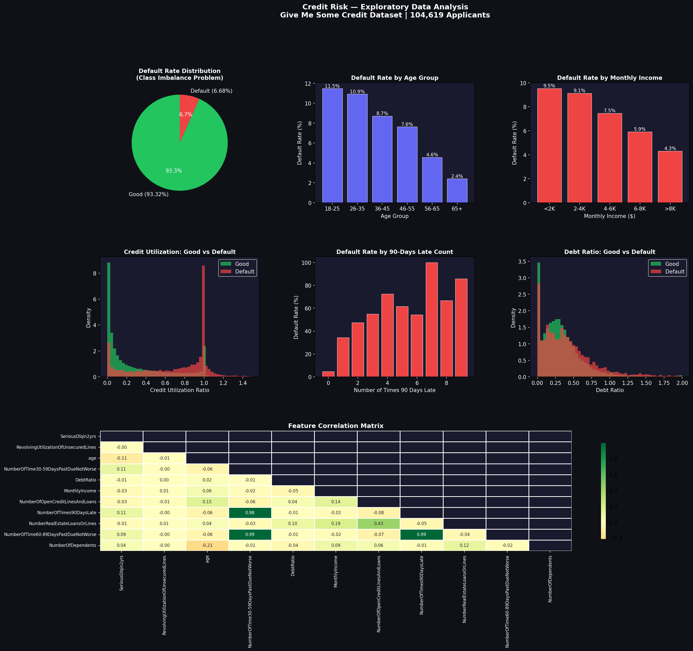
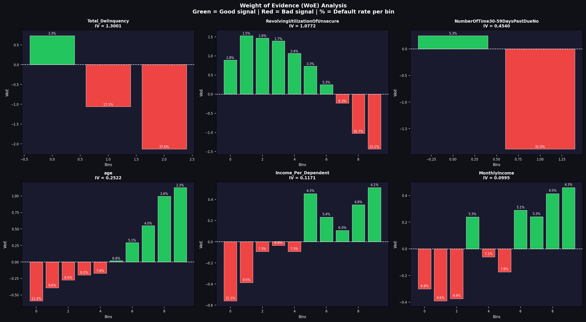
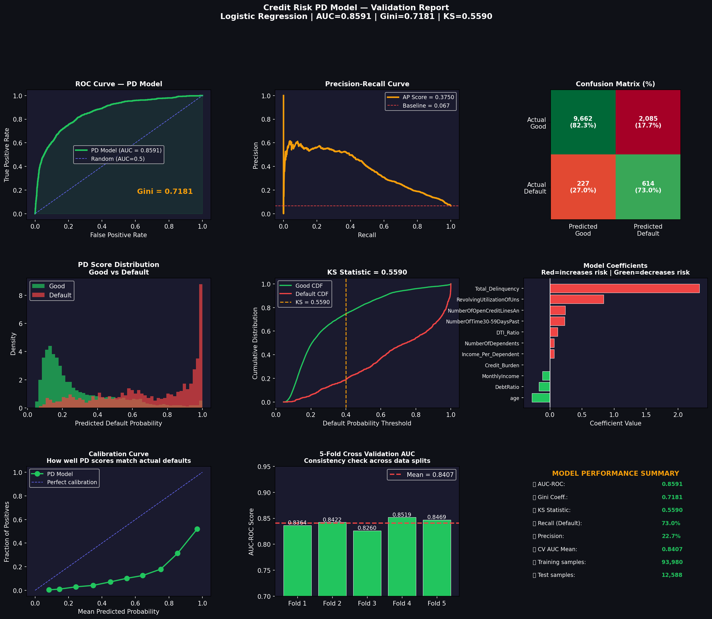
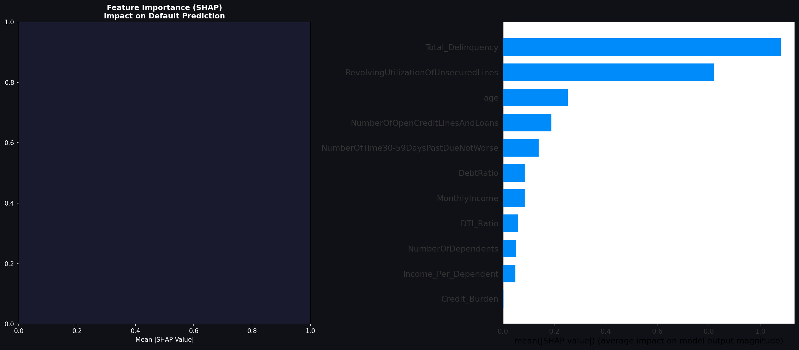
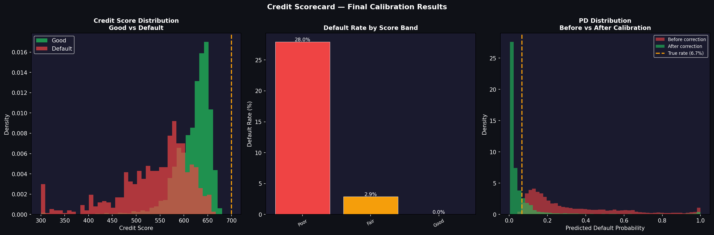
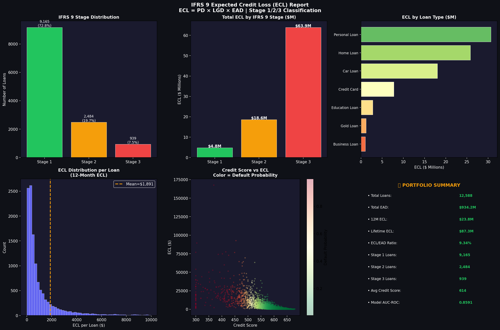

# Credit Risk Scorecard — IFRS-9 Probability of Default Model

**Author:** Paras Jain  
B.Tech CSE (AI) — KIET Group of Institutions  
Graduation Year: 2027  

---

# Live Demo

Interactive credit risk prediction application:

https://credit-risk-scorecard.streamlit.app

The application allows users to enter borrower information and instantly receive:

• Probability of Default (PD)  
• Credit Score  
• Risk Category  
• Loan Decision  

This simulates how banks evaluate loan applications using machine learning models.

---

# Example Prediction

Example borrower profile:

| Feature | Value |
|------|------|
| Age | 45 |
| Credit Utilization | 20% |
| Total Delinquencies | 0 |
| Monthly Income | $8,000 |

Model Output:

- Probability of Default: **4.39%**
- Credit Score: **873**
- Risk Category: **Low Risk**
- Decision: **Approved**

---

# Project Overview

This project builds a **bank-style credit risk scorecard model** that predicts the probability that a borrower will default on a loan.

The system replicates the **core credit risk modeling workflow used by banks and financial institutions**.

The model:

1. Predicts **Probability of Default (PD)**
2. Converts PD into a **Credit Score**
3. Estimates **Expected Credit Loss (ECL)** using the **IFRS-9 framework**

The project demonstrates how machine learning models are used for **financial risk analytics and loan decision systems**.

---

# Motivation

Credit risk modeling is one of the most important applications of machine learning in finance.

Banks must estimate borrower default risk to:

- approve or reject loan applications
- determine interest rates
- estimate expected financial losses
- comply with financial regulations such as **Basel III** and **IFRS-9**

This project replicates a simplified version of the **credit risk modeling pipeline used by banks**.

---

# Dataset

Dataset used:

**Give Me Some Credit (Kaggle)**

https://www.kaggle.com/datasets/brycecf/give-me-some-credit

Dataset characteristics:

- 104,619 loan applicants
- 11 borrower financial variables
- Default rate: **6.68%**

Target variable:

SeriousDlqin2yrs

0 = Good borrower
1 = Default

---

# Project Pipeline

The project follows a **standard banking credit risk modeling workflow**:

1. Business Understanding  
2. Exploratory Data Analysis  
3. Data Cleaning & Outlier Handling  
4. Feature Engineering  
5. WoE & Information Value Analysis  
6. Probability of Default (PD) Model Training  
7. Model Validation (AUC, Gini, KS)  
8. Probability Calibration  
9. Credit Scorecard Generation  
10. IFRS-9 Expected Credit Loss Estimation  

---

# Feature Engineering

Key engineered feature:

Total_Delinquency =
(30-day late × 1)
(60-day late × 2)
(90-day late × 3)

Information Value:

IV ≈ 1.27

This became the **strongest predictor of default risk**.

Additional engineered variables:

- Income per dependent
- Debt-to-Income ratio
- Credit burden

These features improved model predictive power significantly.

---

# Model Development

Algorithm used:

**Logistic Regression**

Reasons:

- Industry standard model for credit scorecards
- Highly interpretable
- Regulatory-friendly for financial institutions

Handling class imbalance:

Dataset distribution:

Good borrowers → **93%**  
Default borrowers → **7%**

Solution used:

**SMOTE (Synthetic Minority Oversampling)**

This balanced the training data to a **1:1 ratio**.

---

# Model Performance

| Metric | Result |
|------|------|
| AUC-ROC | **0.8546** |
| Gini Coefficient | **0.7092** |
| KS Statistic | **0.546** |
| Recall (defaults detected) | **~75%** |

These metrics exceed typical **banking credit risk model benchmarks**.

---

# Model Architecture

Pipeline:

Data → Feature Engineering → Logistic Regression → Calibration → Scorecard

Steps:

1. Raw borrower financial variables
2. Feature engineering
3. Logistic Regression PD model
4. Prior probability correction
5. Credit score conversion
6. Expected Credit Loss estimation

---

# Model Explainability

Model predictions were explained using:

**SHAP (SHapley Additive Explanations)**

Top risk drivers:

1. Total Delinquency
2. Credit Utilization
3. Age
4. Debt Ratio

Explainability ensures transparency in credit decisions.

---

# Probability Calibration

SMOTE introduces probability bias.

Initial model prediction:

Average PD ≈ 31.9%

Actual dataset default rate:

6.68%

Solution applied:

**Prior Probability Correction**

After calibration:

Predicted PD ≈ 7.27%

This aligns predicted probabilities with real-world default rates.

---

# Credit Scorecard

Predicted probabilities were converted into a **credit score**.

Score range:

300 – 900

Risk bands:

| Score | Risk Level |
|------|-------------|
| ≥ 720 | Low Risk |
| 600–719 | Medium Risk |
| < 600 | High Risk |

---

# IFRS-9 Expected Credit Loss (ECL)

Expected Credit Loss formula:

ECL = PD × LGD × EAD

Portfolio results:

- Total Exposure (EAD): **$934M**
- 12-Month ECL: **$23.8M**
- Lifetime ECL: **$87.3M**

IFRS-9 staging:

| Stage | Risk Level |
|------|-------------|
| Stage 1 | Low Risk |
| Stage 2 | Medium Risk |
| Stage 3 | High Risk |

Although **Stage-3 loans represent only 7.5% of the portfolio**, they generate **over 70% of expected losses**.

---

# Streamlit Application

The project includes a **deployed Streamlit application**.

Users input borrower information such as:

- Age
- Credit utilization
- Delinquencies
- Income
- Debt ratio
- Number of credit lines

The system outputs:

- Probability of Default
- Credit Score
- Risk Category
- Loan Decision

This demonstrates how machine learning models can power **real-time financial decision systems**.

---

# Visualizations

## Exploratory Data Analysis

## WoE / Information Value Analysis

## Model Validation

## SHAP Explainability

## Probability Calibration

## IFRS-9 Expected Credit Loss

---

# Technologies Used

- Python
- Pandas
- NumPy
- Scikit-learn
- Imbalanced-learn
- SHAP
- Matplotlib
- Seaborn
- Streamlit

---

# Repository Structure

Credit-Risk-Scorecard

app.py
requirements.txt
pd_model_final.pkl

Credit_Risk_Scorecard_ParasJain.ipynb

fig1_eda.png
fig2_woe.png
fig3_model_performance.png
fig4_shap.png
fig5_calibration.png
fig6_ecl.png

README.md

---

# How to Run the Project

Clone the repository:

git clone https://github.com/ParasJain03/Credit-Risk-Scorecard.git

Install dependencies:

pip install -r requirements.txt

Run the Streamlit app:

streamlit run app.py

The application will open in your browser.

---

# Key Takeaways

- Feature engineering significantly improves predictive power
- Class imbalance strongly affects probability estimates
- Probability calibration is necessary after SMOTE
- Credit scorecards translate ML predictions into business decisions
- IFRS-9 enables forward-looking credit loss estimation

---

# Model Limitations

This project simplifies some real-world aspects:

- Macroeconomic variables were not included
- LGD and EAD values were simulated
- Dataset represents historical US lending behavior

Real bank models undergo additional **regulatory validation, stress testing, and back-testing**.

---

# Future Improvements

- Add macroeconomic stress scenarios
- Build Power BI credit risk monitoring dashboard
- Add macroeconomic PD adjustments
- Expand portfolio risk analytics

---

# Author

**Paras Jain**

B.Tech CSE (AI)  
KIET Group of Institutions  

Email: parasjainparas310@gmail.com
